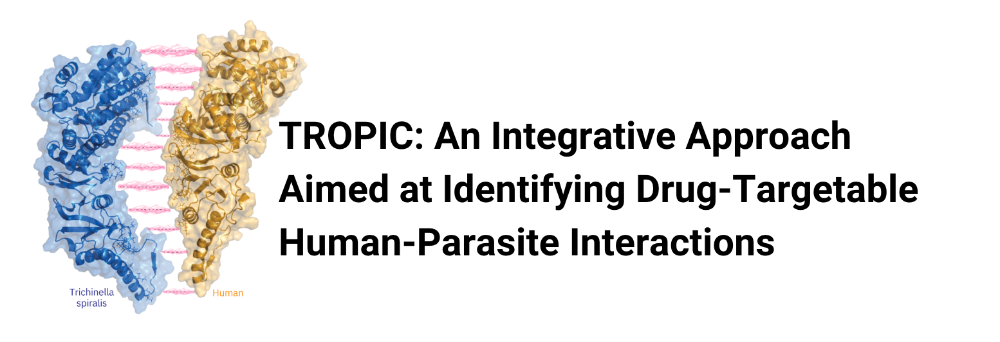
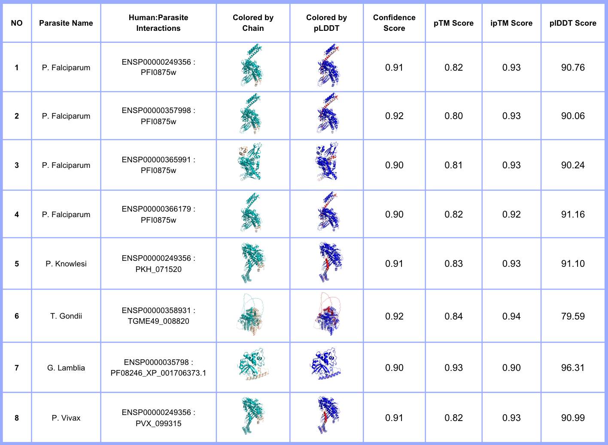

_Prepared by [Beyza Kaynarca](https://github.com/beyzakaynarca) & [Burcu Ozden](https://github.com/BurcuOzden)_

Parasitic diseases, predominantly prevalent in underdeveloped countries and impacting young children, present a significant global concern with substantial socioeconomic impacts. Unfortunately, combating these diseases is challenging due to limited pharmaceutical options and drug resistance. Addressing these challenges requires a comprehensive understanding of molecular interactions between parasites and hosts across various levels. Here, TROPIC (inTegRative hOst-Parasite InteraCtions) introduces a combinatory approach that integrates pathogen genomics and structural biology to explore targetable, new host-parasite interactions. This project is a bilateral collaboration between [CSB-KaracaLab](https://github.com/CSB-KaracaLab) and Cuesto-Astroz Lab, funded by TÜBİTAK and MINCIENCIAS with TÜBİTAK project number 2511.

TROPIC was built upon Dr. Cuesta-Astroz's study¹ unraveling human-parasite interactomes in 15 parasites. For this, we focused on [276 domain-domain interactions](https://github.com/beyzakaynarca/TROPIC/blob/main/Determined-human-parasite-interactions.txt) at the most central nodes of 15 eukaryotic parasites (_T. spiralis, T. gondii, T. brucei, S. mansoni, P. vivax, P. knowlesi, L. infantum, L. donovani, L. braziliensis, C. parvum, G. lamblia, T. cruzi, P. falciparum, C. hominis, and L. mexicana_) and employed domain-domain host-parasite interaction modeling using AlphaFold2-Multimer v2.2² on the Turkish National Computational Resources³ (TRUBA).

## Methodology: Modeling human-parasite interactions using AF2-Multimer and selecting models with a potentially significant biological impact

### AF2-Multimer modeling

Within the TROPIC framework, we utilized the advanced deep learning approach, AlphaFold2-Multimer v2.2 (AF2-Multimer), to model the three-dimensional structures of identified domain-domain interactions. This modeling process was executed on the Palamut node of TRUBA (on 64 cores x 2 CPU & Nvidia A100 GPU) since modeling 276 interactions requires recursive modeling, substantial computational power, and extensive storage data. In our modeling procedure, we used the default settings and generated 25 models for each domain-domain interaction. 

### Evaluation of modeled interactions

Following the completion of the modeling step, the models were evaluated to find the models with high-quality interfaces. This assessment relied on the confidence score provided in the AF2-Multimer output, where
- **Confidence score (Confidence Rank - Confrank)** is a linear combination of the predicted interface TM score (ipTM) and the predicted TM score (pTM), calculated as 0.8 × ipTM + 0.2 × pTM. 
- **ipTM (Interface Predicted Template Modeling) Score** assesses the quality of interfaces in multimeric structures and gauges accuracy at the complex level.
- **pTM (Predicted Template Modeling) Score:** represents the matching value between two constructs and assesses the accuracy of predictions within individual protein chains.

All scores range between 0 and 1, where an increase in scores corresponds to improved model quality.

For each run, among 25 generated models, we selected the _Ranked_0.pdb_ model that has the highest confidence score. For further investigation, we also used pLDDT scores to investigate the quality of the residue predictions as well as the PAE graphs.

- **pLDDT (Predicted Local Distance Difference Test) Score** gauges the accuracy in predicting distances between atoms, ranging from 0 to 100, where a higher score signifies an improvement in model quality. For visual representation, the models were colored based on the pLDDT score, with high-quality residues depicted in various shades of blue and tones, and low-quality residues colored in shades of red.
- **PAE (Predicted Alignment Error) graph** interprets the relative positions of protein domains. The color at coordinates (x, y) in the PAE map signifies AlphaFold's anticipated position error at residue x when aligning the predicted and true structures on residue y.
Low PAE values for residue pairs (x, y) between different domains mean well-defined relative positions and orientations for those domains. On the contrary, high PAE values for residue pairs (x, y) between distinct domains indicate uncertainty in the relative positions and/or orientations of these domains.

## Results: Selected targetable, new host-parasite interactions
We employed [AF2 evaluation script prepared by Andrea Graziadei⁴](https://github.com/grandrea/Alphafold-analysis) to assess the 276 interactions modeled. This analysis script generates PAE and pLDDT plots, 3D structures colored by pLDDT and chains, and a CSV file containing confidence, pLDDT, ipTM, and TM scores. The scores for the Ranked_0 models of each parasite-host interaction are accessible [here](TROPIC-AF2-results.csv).

To identify models with a potentially significant biological impact in host-parasite interactions, we set a confidence score threshold of 0.90 to select highly confident models. Out of the 276 interactions, eight were determined as candidates (Table 1). The run folders corresponding to these selected interactions are deposited in [Aperta⁵](). Each run folder comprises a model folder including 25 generated models (arranged in order of confidence score), an MSA (Multiple Sequence Alignment) folder, a JSON file, a fasta file and a results folder containing our analysis outcomes (PAE and pLDDT graphs, model statistics CSV file, colored structures of the ranked_0 model based on chain and pLDDT score).

**Table 1. Host-Parasite Interactions with Potentially Significant Biological Impacts.** The table contains information on parasite names, Uniprot IDs of host-parasite couples, structures colored by chains and pLDDT, confidence score, pTM, ipTM, and pLDDT scores.

### Contact information:

Ezgi Karaca: ezgi.karaca@ibg.edu.tr

### References
1- Cuesta-Astroz, Y., Santos, A., Oliveira, G., & Jensen, L. J. (2019). Analysis of Predicted Host-Parasite Interactomes Reveals Commonalities and Specificities Related to Parasitic Lifestyle and Tissues Tropism. Frontiers in immunology, 10, 212. https://doi.org/10.3389/fimmu.2019.00212

2- Evans, R., O’Neill, M., Pritzel, A., Antropova, N., Senior, A., Green, T., ... & Hassabis, D. (2021). Protein complex prediction with AlphaFold-Multimer. biorxiv, 2021-10.

3- TRUBA (Turkish National Computational Resources) Website: https://www.truba.gov.tr/

4- Andrea Graziadei, Alphafold-analysis, https://github.com/grandrea/Alphafold-analysis  

5- Aperta (Open Source Archive of Turkey) Website: https://aperta.ulakbim.gov.tr/
