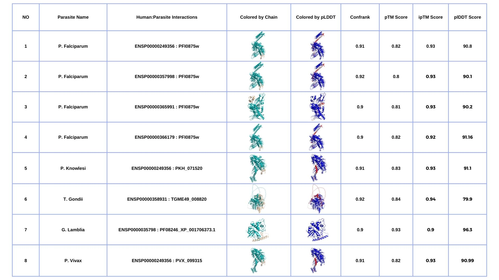

Parasitic diseases, particularly prevalent in underdeveloped countries and among young children, pose a significant global concern with substantial socioeconomic impacts. To overcome the challenges posed by drug resistance and limited pharmaceutical options, understanding molecular interactions between parasites and hosts at the genetic, transcriptomic, proteomic, and metabolomic levels is crucial for unraveling infection patterns and host adaptation. Building on Dr. Cuesta-Astroz's 2019 study¹ that unraveled human-parasite interactomes in 15 parasites, TROPIC proposes a complementary approach involving genomics and structural biology. Here, determined human-parasite interactions were modeled using AF2-Multimer v2.2² on the Turkish National Computational Resources³ (TRUBA).

## Methodology: _Modeling of Identified Human-Parasite Interactions Using AF2-Multimer_

### AF2-Multimer Modeling

Within the framework of the TROPIC, we identified [276 domain-domain interactions](https://github.com/beyzakaynarca/TROPIC/blob/main/Determined-human-parasite-interactions.txt) among human-parasite interactions situated at the most central nodes of 15 eukaryotic parasites (T. spiralis, T. gondii, T. brucei, S. mansoni, P. vivax, P. knowlesi, L. infantum, L. donovani, L. braziliensis, C. parvum, G. lamblia, T. cruzi, P. falciparum, C. hominis, and L. mexicana) in the interactome map. To model the three-dimensional structures of these interactions, we employed the advanced structure modeling method AF2-Multimer v2.2. Modeling was performed on TRUBA since there are 276 interactions to be modeled, requiring recursive modeling. The installation of AF2-Multimer v2.2 was done by following [AF2 github page](https://github.com/google-deepmind/alphafold) and 25 models were generated for each domain-domain interactions.

#### Determination of Druggable Interactions from the Modeled Interactions, Including Structural and Evolutionary Data

In this step, the aim was to evaluate the models based on interface quality and identify models with high-quality interfaces. The models were filtered according to their confidence scores. 
- **Confidence Rank (Confrank) Score**: Confidence score is a linear combination of the predicted interface TM score (ipTM) and the predicted TM score (pTM), determined as 0.8 × ipTM + 0.2 × pTM. 
- **ipTM (Interface Predicted Template Modeling) Score:** Assesses the quality of interfaces in multimeric structures and gauges accuracy at the complex level and. 
- **pTM (Predicted TM Score):** Represents the matching value between two constructs and assess the accuracy of predictions within individual protein chains.

All scores range between 0 and 1. As the scores go from 0 to 1, the model quality increases.

For each run, among 25 generated models, we selected the Ranked_0.pdb model which has the highest confidence score.For further investigation, we also used pLDDT scores to color the 3D structures of models to investigate the quality of the residue predictions on the interface further as well as with the PAE graphs.

- **pLDDT (Predicted Local Distance Difference Test) Score:** According to the pLDDT score calculated by AF2-Multimer, which measures how well the distances between atoms can be predicted, high-quality regions of the models are colored according to blue color and tones, and low-quality regions are colored according to red color and tones.
- **PAE (Predicted Alignment Error)**: PAE graph interprets the relative positions of protein domains. The color at coordinates (x, y) in the PAE map signifies AlphaFold's anticipated position error at residue x when aligning the predicted and true structures on residue y.
Low PAE values for residue pairs (x, y) between different domains means predicts well-defined relative positions and orientations for those domains. On the contrary, high PAE values for residue pairs (x, y) between distinct domains indicate uncertainty in the relative positions and/or orientations of these domains.

## Results
We used AF2-Multimer v2.2 [model evaluation scripts](https://github.com/grandrea/Alphafold-analysis) for the 25 models created for each of the 276 interactions we modeled, generated Predicted Aligned Error (PAE) plots, and conducted summary analyses. From these 25 models, we identified the one with the highest reliability score (ranked_0) as the best model. You can access the file containing the scores for these models [here](TROPIC-AF2-results.csv).
Since we aim to select candidates with a significant biological impact in host-parasite interaction, we set the confidence score (confrank) threshold to 0.9 to choose highly confident models. For 8 candidate interaction models identified to have significant biological impact in host-parasite interaction, you can download the run files from [here](). Within each file corresponding to an interaction, you will find the 25 generated models, MSA (Multiple Sequence Alignment), JSON file, and our analysis results (PAE and pLDDT graphs, model statistics CSV file, ranked_0 model structure with colored by chain and colored by plDDT).

#### References
1- Cuesta-Astroz, Y., Santos, A., Oliveira, G., & Jensen, L. J. (2019). Analysis of Predicted Host-Parasite Interactomes Reveals Commonalities and Specificities Related to Parasitic Lifestyle and Tissues Tropism. Frontiers in immunology, 10, 212. https://doi.org/10.3389/fimmu.2019.00212

2- Evans, R., O’Neill, M., Pritzel, A., Antropova, N., Senior, A., Green, T., ... & Hassabis, D. (2021). Protein complex prediction with AlphaFold-Multimer. biorxiv, 2021-10.

3- https://www.truba.gov.tr/
